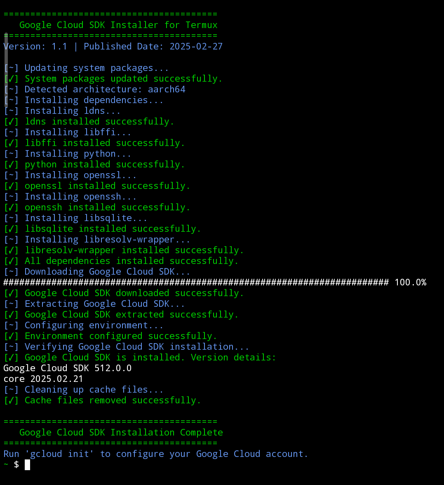

# GCloud SDK Installer for Termux 🚀


A Bash script to automate the installation and setup of **Google Cloud SDK** on **Termux** (Android). This script simplifies the process of installing GCloud on mobile devices, making it easier for developers to manage their cloud resources on the go.

---

## Features ✨

- **One-Command Installation**: Install GCloud SDK with a single command.
- **Automatic Dependency Handling**: Installs all required dependencies.
- **Cross-Platform Support**: Works on `aarch64` and `arm` architectures.
- **Environment Configuration**: Automatically sets up environment variables for seamless usage.
- **Error Handling**: Provides clear error messages and exits gracefully on failures.
- **Cleanup**: Removes temporary files after installation.

---

## Prerequisites 📋

- **Termux**: Install Termux from [F-Droid](https://f-droid.org/en/packages/com.termux/).
- **Internet Connection**: Required for downloading packages and the GCloud SDK.

---

## Installation 🛠️

Run the following command in Termux to install the Google Cloud SDK:

```bash
curl -sS https://raw.githubusercontent.com/notsopreety/gcloud-termux/main/install | bash
```

The script will automatically:
1. Update your system packages.
2. Install all required dependencies.
3. Download and install the Google Cloud SDK.
4. Configure your environment for GCloud.

---

## Usage 🚀

After installation, you can start using the Google Cloud SDK by running:

```bash
gcloud init
```

This will guide you through authenticating and configuring your Google Cloud account.

---

## Screenshots 📸

  
*Example of the installation process.*

---
## Uninstallation 🗑️

To completely remove Google Cloud SDK from Termux, run the following command:

```bash
curl -sS https://raw.githubusercontent.com/notsopreety/gcloud-termux/main/uninstall | bash
```
---

## Contributing 🤝

Contributions are welcome! If you find any issues or have suggestions for improvement, please open an issue or submit a pull request.

1. Fork the repository.
2. Create a new branch (`git checkout -b feature/YourFeature`).
3. Commit your changes (`git commit -m 'Add some feature'`).
4. Push to the branch (`git push origin feature/YourFeature`).
5. Open a pull request.

---

## License 📜

This project is licensed under the **MIT License**. See the [LICENSE](LICENSE) file for details.

---

Enjoy using GCloud on Termux! 🎉
